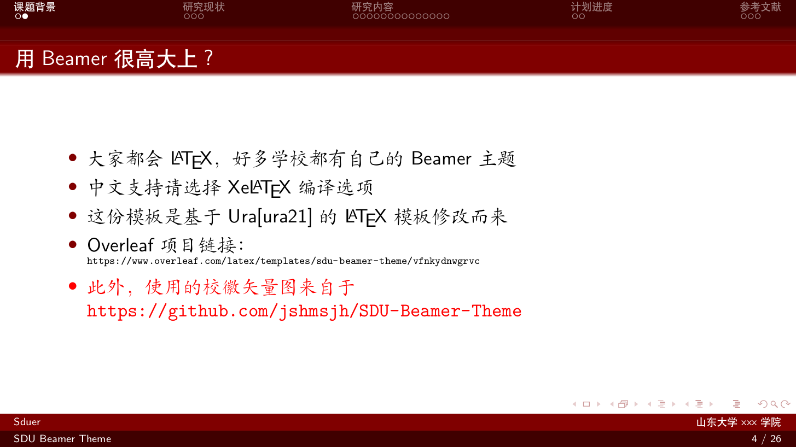
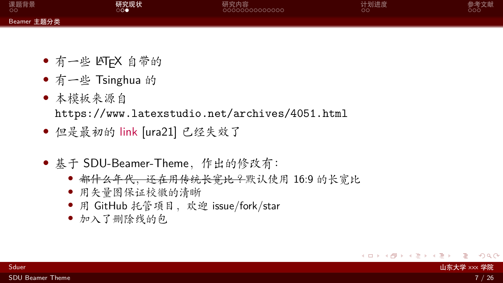

# SDU-Beamer-Theme

A Beamer theme of SDU for academic report, thesis and talk.

Please feel free to submit issues or pull request and give a star⭐️ if the repository helps.

## Screenshots

## Usage

1.   If your software environment is not ready, go check this [LaTeX installation document](https://mirror.macomnet.net/pub/CTAN/info/install-latex-guide-zh-cn/install-latex-guide-zh-cn.pdf) by *Wang Ran* or this [LaTeX tutorial by SUSTech](https://niko.cra.moe/uploads/short-url/9a47N0ThHXRb6em95R7422y8v7b.pdf).
2.   Some basic LaTeX grammar rules are also included in the documents above. If you have any problem, Google it first and it always help.
3.   Clone this repository and you can modify it!

Tips: The file format of the slides generated by LaTeX Beamer is `pdf`, thus sometimes incompatible with some courses' requirements of SDU, which requires `ppt / pptx` files most of the time. So give [pdf2pptx](https://github.com/intMojIBakE/pdf2pptx) or [BeamerStyleSlides](https://github.com/wzpan/BeamerStyleSlides) a try!

## Useful sites

-   Create LaTeX tables online: https://www.tablesgenerator.com/
-   LaTeX/Floats, Figures and Captions: https://en.wikibooks.org/wiki/LaTeX/Floats,_Figures_and_Captions#Tip 

## Overleaf Template

Coming soon.

## Credit

-   The original work of *Ura*, yet more information is missing. Check Ura's template on *overleaf*: https://www.overleaf.com/latex/templates/sdu-beamer-theme/vfnkydnwgrvc
-   The `eps` file of the university's logo is from https://github.com/jshmsjh/SDU-Beamer-Theme.
-   The work is based on [PKU-Beamer-Theme](https://github.com/inFaaa/PKU-Beamer-Theme).
-   [PKU-Beamer-Theme](https://github.com/inFaaa/PKU-Beamer-Theme) is based on [THU-Beamer-Theme](https://github.com/tuna/THU-Beamer-Theme). Thanks to them all.

## License

The repository follows *MIT license*.