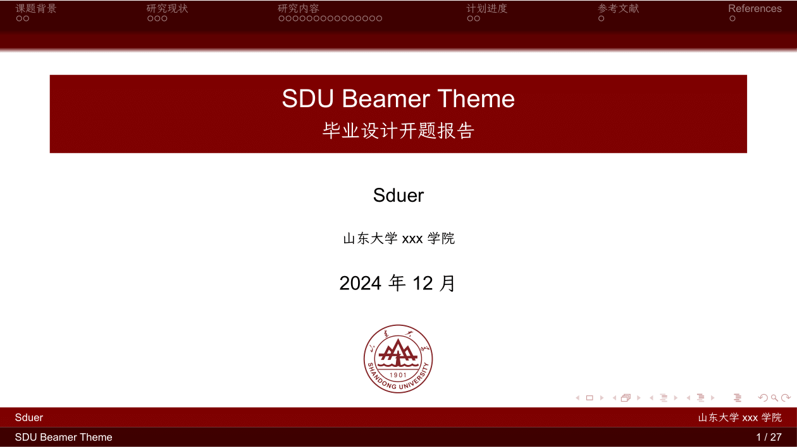
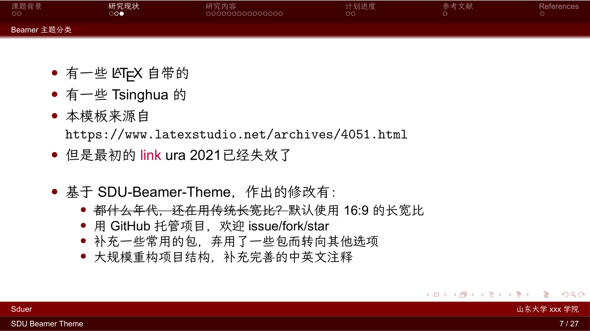
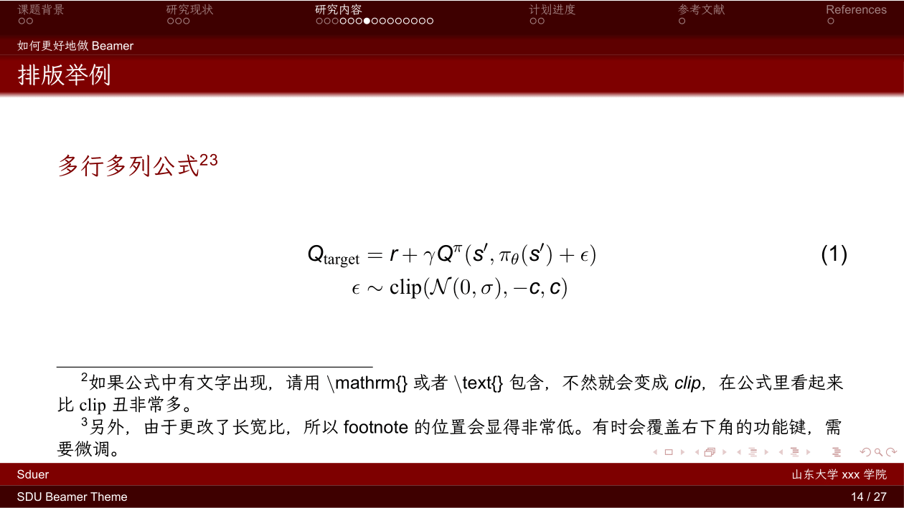

# SDU-Beamer-Theme

SDU 的 Beamer 主题，用于学术报告、论文和演讲。

请随时提交问题或提交 PR。如果该项目有帮助，欢迎 Star⭐️。

[中文版](./README_ch.md), [English version](./README.md)

## 截图

## 使用方法

1.  如果您的软件环境尚未准备好，请查看*王然*的 [一份简短的关于 LaTeX 安装的介绍](https://mirror.macomnet.net/pub/CTAN/info/install-latex-guide-zh-cn/install-latex-guide-zh-cn.pdf) 或者这篇 [南方科技大学的 LaTeX 指南](https://niko.cra.moe/uploads/short-url/9a47N0ThHXRb6em95R7422y8v7b.pdf).
2.  一些基本的 LaTeX 语法规则也包含在上面的文档中。如果您有任何问题，请先尝试搜索，百试不爽。
3.  克隆此存储库，然后您可以对其进行任何修改！

提示：由 LaTeX Beamer 生成的幻灯片的文档格式为 `pdf`，因此有时与山大的某些课程要求不兼容，它们通常要求 `ppt / pptx` 文件。所以不妨试试 [pdf2pptx](https://github.com/intMojIBakE/pdf2pptx) 或者 [BeamerStyleSlides](https://github.com/wzpan/BeamerStyleSlides)！

## 有用的网站

-   在线创建 LaTeX 表格：https://www.tablesgenerator.com/
-   LaTeX 画图画表常用命令：https://en.wikibooks.org/wiki/LaTeX/Floats,_Figures_and_Captions#Tip

## Overleaf 模板

先鸽了，以后再说。

## 感谢

-   SDU-Beamer-Theme 的原作者是 _Ura_，然而缺少更多相关信息。在 _overleaf_ 上查看原项目: https://www.overleaf.com/latex/templates/sdu-beamer-theme/vfnkydnwgrvc
-   山大的 `eps` 矢量图校徽来自于：https://github.com/jshmsjh/SDU-Beamer-Theme
-   本作品基于 [PKU-Beamer-Theme](https://github.com/inFaaa/PKU-Beamer-Theme)。
-   [PKU-Beamer-Theme](https://github.com/inFaaa/PKU-Beamer-Theme) 基于 [THU-Beamer-Theme](https://github.com/tuna/THU-Beamer-Theme)。对上述所有项目表示感谢。

## 协议

该仓库遵循 _MIT 协议_。
